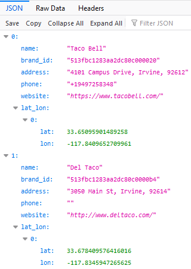
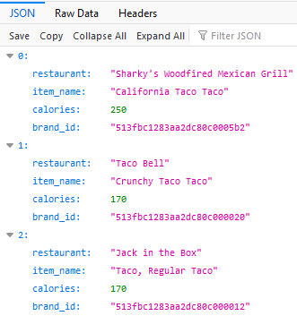

# caeno-backend

### Get Nearby Restaurants:
--------------------------
**ROUTE [el/restaurants]:**

http://172.112.215.241/el/restaurants?keyword=taco&dist=10&lat=33.645&lng=-117.843

Arguments:
- keyword
- dist (in miles)
- lat
- lng


```json
[{"name": "Taco Bell", "brand_id": "513fbc1283aa2dc80c000020", "address": "4101 Campus Drive, Irvine, 92612", "phone": "+19497258348", "website": "https://www.tacobell.com/", "lat_lon": [{"lat": 33.65095901489258, "lon": -117.8409652709961}]}, {"name": "Del Taco", "brand_id": "513fbc1283aa2dc80c0000b4", "address": "3050 Main St, Irvine, 92614", "phone": "", "website": "http://www.deltaco.com/", "lat_lon": [{"lat": 33.678409576416016, "lon": -117.8345947265625}]}, {"name": "Taco Bell", "brand_id": "513fbc1283aa2dc80c000020", "address": "4101 CAMPUS DR, Irvine, 92612", "phone": "+19497258322", "website": "https://www.tacobell.com/", "lat_lon": [{"lat": 33.647926330566406, "lon": -117.8372802734375}]}, {"name": "Taco Bell", "brand_id": "513fbc1283aa2dc80c000020", "address": "17901 Von Karman Ave, Irvine, 92614", "phone": "+19498634500", "website": "https://www.tacobell.com/", "lat_lon": [{"lat": 33.68659591674805, "lon": -117.84396362304688}]}, {"name": "Del Taco", "brand_id": "513fbc1283aa2dc80c0000b4", "address": "2701 S GRAND AVE, Santa Ana, 92705", "phone": "+17145406157", "website": "http://www.deltaco.com/", "lat_lon": [{"lat": 33.709999084472656, "lon": -117.85029602050781}]}, {"name": "Del Taco", "brand_id": "513fbc1283aa2dc80c0000b4", "address": "2900 S MAIN ST, Santa Ana, 92707", "phone": "+17149790037", "website": "http://www.deltaco.com/", "lat_lon": [{"lat": 33.70859146118164, "lon": -117.86802673339844}]}, {"name": "Taco Bell", "brand_id": "513fbc1283aa2dc80c000020", "address": "401 Newport Center Dr Ste A107, Newport Beach, 92660", "phone": "+19497060303", "website": "https://www.tacobell.com/", "lat_lon": [{"lat": 33.61608123779297, "lon": -117.87474822998047}]}, {"name": "Taco Bell", "brand_id": "513fbc1283aa2dc80c000020", "address": "2246 S GRAND AVE, Santa Ana, 92705", "phone": "+17145574844", "website": "https://www.tacobell.com/", "lat_lon": [{"lat": 33.716400146484375, "lon": -117.85060119628906}]}, {"name": "Del Taco", "brand_id": "513fbc1283aa2dc80c0000b4", "address": "2841 W WARNER AVE, Santa Ana, 92704", "phone": "+17149570900", "website": "http://www.deltaco.com/", "lat_lon": [{"lat": 33.71515655517578, "lon": -117.9078140258789}]}, {"name": "Taco Bell", "brand_id": "513fbc1283aa2dc80c000020", "address": "1400 W COAST HWY, Newport Beach, 92663", "phone": "+19496468656", "website": "https://www.tacobell.com/", "lat_lon": [{"lat": 33.619998931884766, "lon": -117.91600036621094}]}]
```


### Get Nearby Food Items
-------------------------
**ROUTE [/el/menu]:**

http://172.112.215.241/el/menu?keyword=taco&dist=10&lat=33.645&lng=-117.843

Arguments:
- keyword
- dist (in miles)
- lat
- lng


```json
[{"restaurant": "Sharky's Woodfired Mexican Grill", "item_name": "California Taco Taco", "calories": 250, "brand_id": "513fbc1283aa2dc80c0005b2"}, {"restaurant": "Taco Bell", "item_name": "Crunchy Taco Taco", "calories": 170, "brand_id": "513fbc1283aa2dc80c000020"}, {"restaurant": "Jack in the Box", "item_name": "Taco, Regular Taco", "calories": 170, "brand_id": "513fbc1283aa2dc80c000012"}, {"restaurant": "Sharky's Woodfired Mexican Grill", "item_name": "Fajita Taco Taco", "calories": 330, "brand_id": "513fbc1283aa2dc80c0005b2"}, {"restaurant": "Sharky's Woodfired Mexican Grill", "item_name": "Original Taco Taco", "calories": 170, "brand_id": "513fbc1283aa2dc80c0005b2"}, {"restaurant": "Taco Bell", "item_name": "Crunchy Taco Supreme Taco", "calories": 190, "brand_id": "513fbc1283aa2dc80c000020"}, {"restaurant": "Taco Bell", "item_name": "Double Decker Taco Taco", "calories": 320, "brand_id": "513fbc1283aa2dc80c000020"}, {"restaurant": "Taco Bell", "item_name": "Soft Taco - Beef Taco", "calories": 180, "brand_id": "513fbc1283aa2dc80c000020"}, {"restaurant": "Taco Bell", "item_name": "Soft Taco - Chicken Taco", "calories": 170, "brand_id": "513fbc1283aa2dc80c000020"}, {"restaurant": "Veggie Grill", "item_name": "Single Fish Taco Taco", "calories": 190, "brand_id": "53433c42467de62e2cdff994"}]
```


Nutrix API Get Nearby Restaurants
---------------------------------
**ROUTE [/restaurants]:**

Arguments: 
- dist (in miles)
- lat
- lng
- lim (optional, default = 20, max = 50)

Usage example:
/restaurants?dist=2&lat=33.992&lng=-117.374&lim=2

```json
{
  "locations": [
    {
      "name": "Starbucks",
      "brand_id": "513fbc1283aa2dc80c00001f",
      "fs_id": null,
      "address": "3311 MARKET ST",
      "address2": null,
      "city": "Riverside",
      "state": "CA",
      "country": "US",
      "zip": "92501",
      "phone": "+19517829836",
      "website": "http://www.starbucks.com",
      "guide": null
      "id": 766916,
      "lat": 33.987220764160156,
      "lng": -117.37255096435547,
      "created_at": "2017-06-26T21:50:52.000Z",
      "updated_at": "2017-08-20T14:16:11.000Z",
      "distance_km": 0.5479654217321449
    },
    {
      "name": "Baker's Drive-thru",
      "brand_id": "513fbc1283aa2dc80c0001fc",
      "fs_id": null,
      "address": "2221 MAIN ST",
      "address2": null,
      "city": "Riverside",
      "state": "CA",
      "country": "US",
      "zip": "92501",
      "phone": "+19513289016",
      "website": "",
      "guide": null,
      "id": 2004912,
      "lat": 33.995418548583984,
      "lng": -117.36546325683594,
      "created_at": "2017-07-14T18:38:17.000Z",
      "updated_at": "2017-08-20T14:16:01.000Z",
      "distance_km": 0.8740053493738467
    }
  ]
}
```

